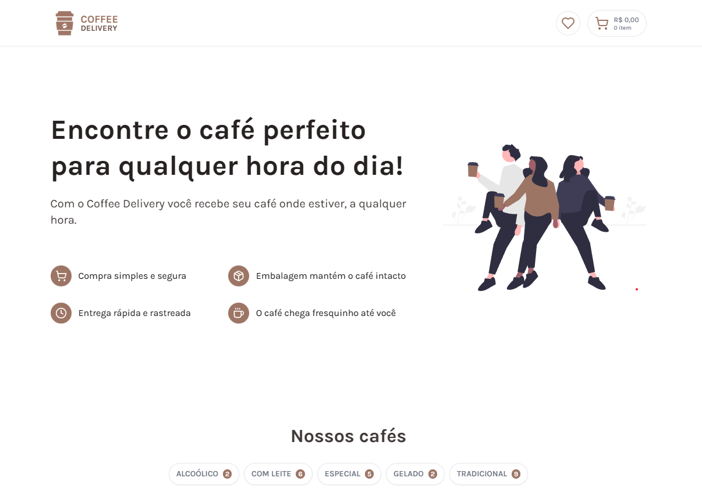

# Coffee Delivery App

## Descrição do projeto
O Coffee Delivery App é um aplicativo de entrega de café que permite aos usuários encomendar suas bebidas favoritas de cafeterias locais e receber a entrega em sua porta. O aplicativo é fácil de usar e oferece uma experiência rápida e conveniente para os amantes de café.
## Funcionalidades

O aplicativo possui as seguintes funcionalidades principais:

- Visualização do menu de bebidas: Os usuários podem visualizar o menu completo de bebidas disponíveis para pedido.

- Seleção de bebidas: Os usuários podem adicionar suas bebidas favoritas ao carrinho de compras.

- Carrinho de compras: Os usuários podem visualizar e editar os itens adicionados ao carrinho de compras.

- Checkout: Os usuários podem concluir o pedido e fornecer os detalhes necessários para entrega.

## Bibliotecas Usadas
Neste projeto, foram utilizadas diversas bibliotecas para auxiliar no desenvolvimento e aprimorar a experiência do usuário. Abaixo estão as principais bibliotecas utilizadas:

React: Biblioteca JavaScript de código aberto utilizada para construir interfaces de usuário interativas e reativas.

API ViaCEP: API para consultar informações de CEP (Código de Endereçamento Postal) brasileiro, utilizada para obter dados de endereços no projeto.

Tailwind CSS: Framework CSS altamente customizável, que facilita a criação de interfaces modernas e responsivas.

Tailwind Scrollbar: Plugin para Tailwind CSS que possibilita a estilização personalizada de barras de rolagem.

React Hook Form: Biblioteca para gerenciamento de formulários no React, tornando o processo de validação e envio de dados mais simples e eficiente.

Zod: Uma biblioteca de esquemas de validação de dados altamente eficiente para JavaScript/TypeScript.

Immer: Biblioteca para criar cópias imutáveis de objetos no JavaScript de forma mais intuitiva e concisa.

Framer Motion: Biblioteca para animações e transições suaves no React, proporcionando uma experiência visualmente agradável.

React Loading Skeleton: Componente React para criar skeletons (estruturas vazias) de carregamento, melhorando a usabilidade enquanto o conteúdo real é carregado.

Essas bibliotecas foram escolhidas devido à sua qualidade e funcionalidades que complementam as necessidades específicas do projeto, permitindo o desenvolvimento de um aplicativo eficiente e amigável aos usuários.

## Licença

Este projeto é licenciado sob a Licença [MIT](https://choosealicense.com/licenses/mit/).

## 
Espero que você aprecie o Coffee Delivery App! Sinta-se à vontade para entrar em contato se tiver alguma dúvida ou comentário. Aproveite suas bebidas e feliz codificação! ☕️👩‍💻
